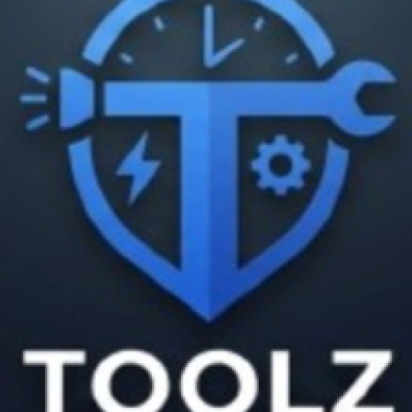

# Toolz

<p align="center">
  
</p>

<p align="center">
  <strong>Your device, fully orchestrated.</strong>
</p>

<p align="center">
  Toolz is a modern Android toolkit that brings productivity, media, PDF, sensor, privacy, and system utilities into one polished app.
  It is built for people who want one fast home for the tools they actually use, not a folder full of single-purpose apps.
</p>

<p align="center">
  
  
  
  
</p>

Toolz currently targets Android 12 and above, ships from this repository as version `1.0.6`, and combines 30+ precision instruments into a single Compose-first experience. Many tools work locally on-device, while connected features like AI, web search, music catalog downloads, and update checks use the internet when needed.

## Why Toolz

Toolz is designed to feel like a real daily driver, not a demo shelf.

- One app for timers, notes, PDFs, media, utilities, sensors, and device tools.
- A polished dashboard with quick access, pinned tools, recent tools, widgets, and a universal floating status pill.
- Strong local capabilities for vaults, clipboard history, PDF work, conversion, measurement, and sensors.
- Optional AI where it actually helps, including assistant flows, smart matching, and document summaries.
- Android-native integrations like Autofill, notification listening, accessibility-powered focus controls, quick settings tiles, and app widgets.

## Standout Features

- **Focus Flow** tracks app usage, scores productivity, supports daily app limits, and can use accessibility-powered hard locks for advanced focus modes.
- **Password Vault** stores credentials in an encrypted SQLCipher-backed database, supports biometric unlock, Autofill, password generation, CSV import, and vault health checks.
- **Notification Vault** captures selected notifications into a searchable local archive with filters and app-level controls.
- **PDF Reader** opens PDF files directly from Android share/open flows, scans documents with OCR, extracts text, and supports AI-assisted summaries.
- **File Converter** handles video, audio, image, and PDF conversion workflows with FFmpeg-backed processing and PDF-to-image support.
- **Music Player** supports local playback, lyrics, Media3 controls, and a catalog/download flow for expanding your library.
- **Widgets and tiles** include homescreen widgets for flashlight, notes, steps, compass, flip coin, and music, plus quick settings tiles for Clipboard and Caffeinate.

## What You Can Do In Toolz

### Smart Flow & AI

- AI Assistant with configurable providers and model selection.
- Smart dashboard search that matches intent to the right tool.
- Web search with DuckDuckGo HTML results, bookmarks, quick links, and DNS/ad-block controls.
- Quick capture tools like Todo and Notepad for notes, reminders, and lightweight planning.

### Time & Focus

- Timer, Stopwatch, Pomodoro, World Clock, Calendar, and Todo workflows in one place.
- Focus Flow for usage analytics, weekly summaries, focus insights, and app limits.
- Caffeinate mode to keep the screen awake when you need it.

### Media & PDF

- Music playback, voice recording, and media browsing.
- File conversion across video, audio, image, animation, and document formats.
- PDF reading, OCR overlays, extracted text, and document summaries.

### Sensors & Vision

- Flashlight, Screen Light, Magnifier, QR/barcode Scanner, and Light Meter.
- Compass, Bubble Level, Speedometer, Altimeter, Step Counter, and Ruler.
- Color Picker and Sound Meter for quick environmental measurements.

### Security & System

- Password Vault, password generation, clipboard history, and notification history.
- Device Info, Battery Info, File Cleaner, Periodic Table, Flip Coin, and random generation tools.
- Homescreen widgets and quick settings integrations for faster access from anywhere.

## Install Toolz

Toolz is distributed through GitHub Releases:

- Releases page: [github.com/freroxx/toolz/releases](https://github.com/freroxx/toolz/releases)
- Current repo version: `1.0.6`

Download the APK that matches your device:

- `arm64-v8a` for most modern Android phones
- `armeabi-v7a` for older 32-bit ARM devices
- `x86_64` for many emulators and x86_64 environments
- `x86` for older x86 emulator/device setups

If you already have Toolz installed, the app also includes an in-app updater that checks GitHub releases and the project update manifest for compatible builds.

## Build From Source

### Requirements

- Android Studio
- Android SDK `36` (`compileSdk 36`, `targetSdk 36`)
- JDK `17`
- A device or emulator running Android `12+` (`minSdk 31`)

### Optional AI Environment Keys

Toolz can run core utilities without personal AI keys, but AI-related features work best when you provide your own provider keys.

Create a root `.env` file if you want to bake default keys into your build:

```env
GEMINI_DEFAULT=
CHATGPT_DEFAULT=
GROQ_DEFAULT=
OPENROUTER_DEFAULT=
CLAUDE_DEFAULT=
DEEPSEEK_DEFAULT=
```

### Build Commands

macOS/Linux:

```bash
./gradlew assembleDebug
```

Windows:

```powershell
.\gradlew.bat assembleDebug
```

Import the project into Android Studio, let Gradle sync, and the debug APK will be generated through the standard Android build pipeline.

## Tech Stack

- Kotlin + Jetpack Compose
- Hilt for dependency injection
- Room with SQLCipher-backed encrypted storage
- WorkManager for scheduled background work
- Media3 for audio playback and session handling
- ML Kit for barcode scanning and text recognition
- FFmpegKit for media conversion
- Retrofit + OkHttp + Moshi for networking and serialization
- AndroidX PDF Viewer for in-app PDF handling

## Permissions And Privacy

Toolz uses different Android permissions depending on which tools you enable. The app asks for powerful access because some of its features are deeply integrated with the system, not because every tool needs every permission.

| Feature area | Access used | Why it is needed |
| --- | --- | --- |
| Focus Flow | Usage Access, Accessibility, overlay-related access | To analyze app usage, enforce app limits, and show advanced focus controls |
| Notification Vault | Notification listener access | To capture and organize notifications inside the vault |
| Password Vault | Biometric auth, Autofill service | To unlock the vault securely and fill saved credentials |
| Search, updates, AI, catalog | Internet/network access | For DuckDuckGo HTML search, update checks, provider-backed AI, and music catalog/download features |
| Camera tools | Camera and flashlight | For scanning, magnifier, flashlight, and light-related tools |
| Audio tools | Microphone and media access | For voice recording, playback, and music library features |
| Motion and navigation tools | Activity recognition, location, sensors | For step counting, speed, compass, altitude, and related measurements |
| File-based tools | Media and document access | For PDF opening, music indexing, conversion, cleaner workflows, and exported output |

Toolz is not presented here as a fully offline app. Many tools work entirely on-device, but connected features such as AI, web search, catalog downloads, and update checks require network access.

AI is optional. You can use Toolz's core utilities without configuring personal provider keys.

## Support

- Repository: [github.com/freroxx/toolz](https://github.com/freroxx/toolz)
- Releases: [github.com/freroxx/toolz/releases](https://github.com/freroxx/toolz/releases)
- Discord: [discord.gg/aAswRUerwh](https://discord.gg/aAswRUerwh)

If you want to report a bug, suggest an improvement, or contribute to Toolz, open an issue or pull request in this repository.
